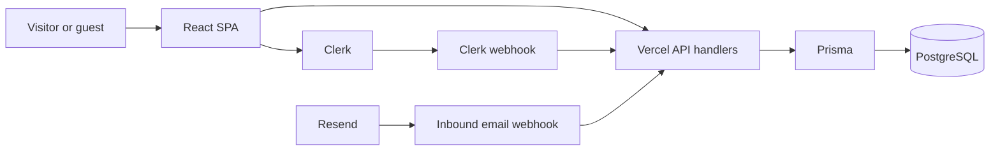

# Architecture Reference

## System Overview

The Druids Den is a React 19 single-page application built by Vite and deployed
with Vercel. Vercel serves the static client bundle, rewrites non-API routes to
the SPA entry point, and runs handlers under `api/` as serverless functions.

The application uses Clerk for authentication, PostgreSQL through Prisma for
application data, Resend for email, Svix for webhook signature verification,
and Vercel Analytics and Speed Insights for observability.

## Client Routes And Access

| Route | Access model | Purpose |
| --- | --- | --- |
| `/`, `/the-den`, `/what-to-expect`, `/gallery`, `/northwoods`, `/story`, `/stay`, `/traditions` | Public | Marketing, cabin, regional, and traditions content. |
| `/guide` | Public implementation; invited-guest intent | General guest information only. It must not contain private details. |
| `/spooktoberfest` | Passcode gate | Event-specific content protected by a server-validated passcode flow. |
| `/reservations` | Approved Clerk account | Reservation request form. |
| `/dashboard` | Approved `OWNER` or `ADMIN` account | Reservation, guest, and reporting operations. |
| `/sign-in`, `/sign-up` | Public | Clerk entry points. |
| `/feedback/:reservationId` | Link-accessible | Guest feedback form. |
| `*` | Public | Redirects to `/`. |

`ClerkAuthGate` owns Clerk authentication, account-approval, and role checks in
the client. `ProtectedRoute` owns the Spooktoberfest route gate. API handlers
must enforce the corresponding authorization boundaries independently.

## Server Boundaries

All authenticated API handlers expect `Authorization: Bearer <Clerk token>`.
`api/_utils/auth.js` verifies the token, resolves the corresponding Prisma user,
and synchronizes a missing application user from Clerk when possible.

Authorization is layered:

1. `verifyAuth` requires a valid Clerk token.
2. `requireApprovedUser` requires account status `APPROVED`.
3. `requireRole` requires an approved user with an allowed role, such as
  `OWNER` or `ADMIN`.

The Prisma `User` record is the source of truth for application roles and
approval status. Clerk webhooks create or update the application record and
soft-delete it on Clerk user deletion.

## API Surface

| Endpoint | Methods | Boundary |
| --- | --- | --- |
| `/api/availability` | `GET` | Public date-availability lookup. |
| `/api/send-reservation` | `POST` | Approved guest reservation request. |
| `/api/reservations` | `GET`, `POST` | Owner/admin list and owner-hold creation. |
| `/api/reservations/[id]` | `PATCH`, `DELETE` | Owner/admin reservation change or soft deletion. |
| `/api/user/status` | `GET` | Authenticated current application user. |
| `/api/users` | `GET`, `PATCH` | Owner/admin guest-account list and account-status change. |
| `/api/message-guest` | `POST` | Owner/admin guest message. |
| `/api/verify-passcode` | `POST` | Spooktoberfest passcode validation. |
| `/api/webhooks/clerk` | `POST` | Svix-signed Clerk lifecycle events. |
| `/api/receive-email` | `POST` | Svix-signed Resend inbound-email events. |

Detailed request, response, error, and webhook information belongs in
`docs/api.md`. Keep client code and handlers consistent when a contract changes.

## Reservation Rules

The server sanitizes reservation input, recalculates the estimated total, and
rechecks date conflicts before it writes data. Current implementation behavior
uses a $150 nightly estimate and a two-night minimum. The product record owns
whether those terms may appear in public copy.

Pending and approved, non-deleted reservations block overlapping dates. Owner
reservation creation and changes apply the same conflict behavior. Reservation
deletion sets `deletedAt`; it does not physically remove a record.

## Data Model

Prisma models are `User`, `Reservation`, `BlackoutDate`, `Feedback`, `Message`,
and `AuditLog`. The schema includes application roles, approval states,
reservation states, feedback moderation fields, messaging relations, and soft
delete timestamps. `AuditLog` is modelled but not currently written by the
reviewed application handlers; do not document it as active auditing until that
behavior exists.

See `docs/data-model.md` for relationships, migration conventions, and
implementation constraints that are not database constraints.

## External Services And Configuration

- Clerk handles user identity and posts lifecycle webhooks to the application.
- Resend sends transactional email and posts inbound email webhooks.
- Svix validates both webhook sources before their payloads are trusted.
- `DATABASE_URL` selects PostgreSQL; local override handling is implemented in
  `scripts/start-local.js` and `prisma.config.ts`.
- `PRISMA_DATABASE_URL` may select an Accelerate proxy at runtime.
- Vercel functions are configured with 1024 MB memory and a 10-second maximum
  duration in `vercel.json`.

Client `VITE_*` variables are exposed to the browser. Never put secrets,
guest-private data, or actual guide credentials in them. See
[content-and-privacy.md](content-and-privacy.md).

## Security And Reliability Controls

- Reservation input is validated on the client and sanitized on the server.
- Clerk and Resend webhook handlers require Svix verification.
- The rate limiter uses client IP and endpoint-specific limits. It is in-memory,
  per-instance, resets on cold starts, and is bypassed in tests. It is
  best-effort protection, not a distributed rate-limit guarantee.
- Email delivery failures are handled separately from persisted reservation
  requests where appropriate. Do not treat an email result as a database
  transaction.
- Soft-deleted rows require `deletedAt: null` filtering in ordinary queries.

## Validation Commands

| Change type | Required baseline check |
| --- | --- |
| Documentation only | `git diff --check` and link/reference review. |
| Client code or styles | `npm run lint`, `npm run test:run`, `npm run build`, then mobile and desktop visual inspection. |
| API, auth, or data behavior | `npm run lint`, relevant API tests, `npm run test:run`, and `npm run build`. |
| Prisma schema or migrations | Run the applicable Prisma migration command against a safe database, then the API/data test slice and full build. |
| Privacy, metadata, or guide changes | Perform the content-and-privacy review in addition to the checks above. |

The available scripts are defined in `package.json`: `npm start`,
`npm run start:local`, `npm run dev`, `npm run build`, `npm run lint`, `npm test`,
`npm run test:run`, `npm run test:ui`, `npm run db:deploy`, `npm run db:seed`,
and `npm run db:reset`. `db:reset` is destructive.