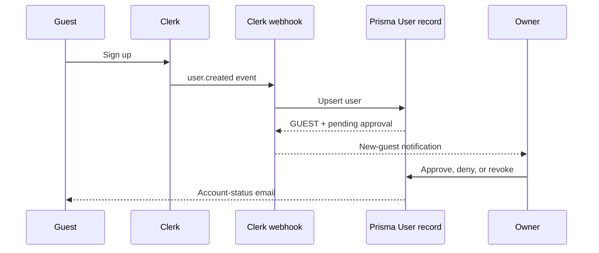

# Authentication And Accounts

Clerk owns identity and session tokens. The PostgreSQL `User` record owns application roles and account approval state. A valid Clerk session alone does not grant access to approved-guest or owner features.

## Account Lifecycle

Clerk `user.created` and `user.updated` webhook events call the application user-sync path. The configured owner email is automatically created as an approved `OWNER`; other newly synced accounts are `GUEST` users in `PENDING_APPROVAL`. The server can also retrieve a missing Clerk user and synchronize it on the next authenticated status request.

Clerk `user.deleted` events set the matched application's `deletedAt` timestamp. They do not physically delete the record.

## Roles

| Role | Access |
| --- | --- |
| `GUEST` | May use approved-guest capabilities once account status is `APPROVED`. |
| `ADMIN` | May use the owner/admin dashboard and owner/admin API endpoints once approved. |
| `OWNER` | May use the owner/admin dashboard and owner/admin API endpoints once approved. |

Do not set application roles based on client-provided data or UI state. Server endpoints use the database role after token verification.

## Account Statuses

| Status | Effect |
| --- | --- |
| `PENDING_APPROVAL` | Default state for a new guest; reservation requests are blocked. |
| `APPROVED` | Enables approved-guest features. Required before role-based access is considered. |
| `DENIED` | Guest remains blocked. |
| `REVOKED` | Previously granted access is blocked. |

Owners and administrators update guest status through `PATCH /api/users`. That path records the change time and actor, then attempts to send the relevant account-status email. It only updates `GUEST` records.

## Route And API Enforcement

`ClerkAuthGate` protects `/reservations` with `requireApproval` and `/dashboard` with `OWNER` or `ADMIN` roles. `api/_utils/auth.js` separately enforces the same progression for API calls: token verification, approval, then role where required.

The Spooktoberfest passcode gate is separate from Clerk and does not make its event-specific token equivalent to an account session. The public guide is also separate: it is currently not an authentication boundary and cannot contain private information.

## Webhook Operations

Configure Clerk to send lifecycle events to `/api/webhooks/clerk` and store the signing secret as server-only configuration. The handler requires standard Svix headers and verifies the signature before processing the event.

Clerk webhook traffic is rate-limited per instance. Delivery requests are limited before signature verification; `user.created` has a stricter verified-event limit. See [API reference](api.md) for current limits and response behavior.

## Change Checklist

- Update this document, the route matrix, and API tests when changing roles or statuses.
- Preserve the server authorization check when adding a protected client route.
- Review signup notifications and account-status email templates when lifecycle behavior changes.
- Do not log tokens, webhook secrets, email addresses, or guest account details in public documentation or analytics.