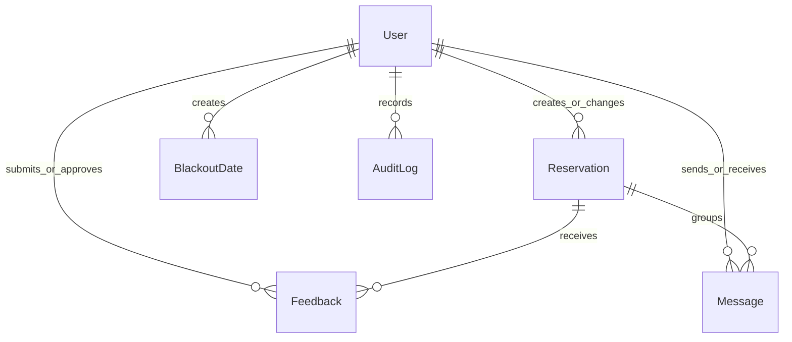

# Data Model

PostgreSQL is accessed through Prisma. The authoritative schema is `prisma/schema.prisma`; apply schema changes through reviewed Prisma migrations rather than ad hoc database edits.

## Entities

| Model | Purpose |
| --- | --- |
| `User` | Clerk-linked identity, application role/status, contact preferences, and ownership of related records. |
| `Reservation` | Guest or owner reservation with stay dates, guest details, status, notes, and soft-delete state. |
| `BlackoutDate` | An unavailable date range with optional reason and creator. |
| `Feedback` | Post-stay rating and review with future-publication moderation fields. |
| `Message` | Reservation-linked messages between a sender and recipient. |
| `AuditLog` | Schema support for audit events. No reviewed handler currently writes audit-log records. |

## Relationships

A reservation may have no `userId` because the model preserves guest information independently. Feedback and messages also allow nullable user or reservation associations for their defined lifecycle cases. Do not make a nullable field required without a migration and a compatibility review.

## Status Values

| Enum | Values |
| --- | --- |
| `Role` | `GUEST`, `ADMIN`, `OWNER` |
| `AccountStatus` | `PENDING_APPROVAL`, `APPROVED`, `DENIED`, `REVOKED` |
| `ReservationStatus` | `PENDING`, `APPROVED`, `DENIED`, `CANCELLED`, `COMPLETED` |
| `ContactMethod` | `EMAIL`, `TEXT`, `BOTH` |
| `MessageType` | `APPROVAL`, `DENIAL`, `CANCELLATION`, `INQUIRY`, `RESPONSE` |

## Soft Deletion

`User`, `Reservation`, `BlackoutDate`, `Feedback`, and `Message` carry a nullable `deletedAt` timestamp. Normal queries must filter `deletedAt: null`. The reservation API deletion path is intentionally a soft delete. Do not replace this with a physical delete without defining retention, recovery, and privacy implications.

The present application does not uniformly centralize this filter in Prisma middleware. New query paths must add it explicitly when they operate on ordinary active records.

## Constraints Implemented Outside Prisma

- Reservation submission currently uses a two-night minimum and a $150 nightly estimate. Pricing is recalculated server-side in `api/_utils/pricing.js`.
- Reservation date overlap is checked in the handler against non-deleted pending and approved reservations.
- Server sanitization constrains input formats, guest counts, and text lengths.
- The public product capacity is six guests, but the current reservation sanitizer permits a larger raw adult/child total. Preserve the owner-confirmed public capacity when reviewing reservation validation changes.

These are application constraints, not database constraints. Update this document and tests whenever their source of truth changes.

## Migrations And Local Data

Use `npm run db:deploy` to apply pending migrations and `npm run db:seed` for synthetic development data. `npm run db:reset` destroys and recreates the target database before seeding it; use a disposable database only.

Review generated migration SQL, backfill needs, nullability changes, indexes, and rollback options before applying a production migration. Prisma does not provide the operational database backup policy; that remains an owner/operator responsibility.